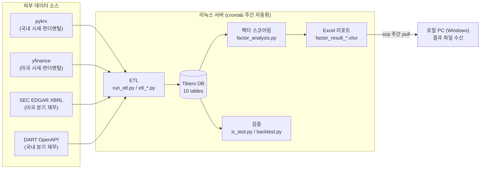
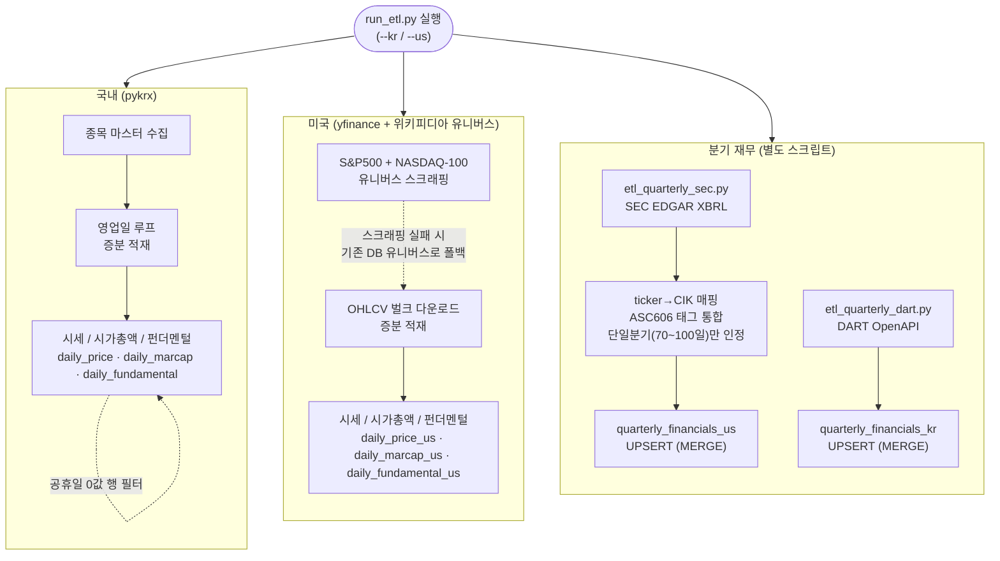
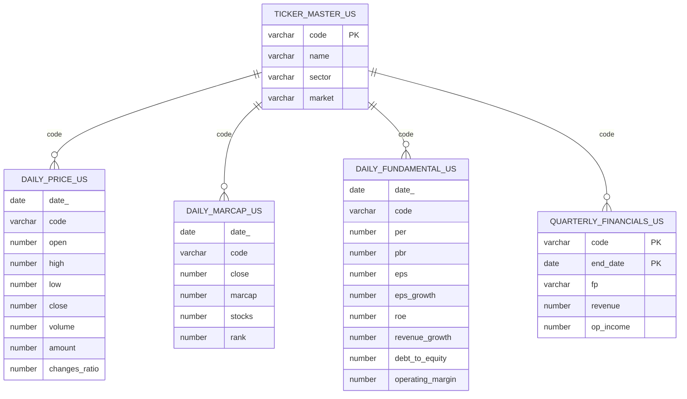
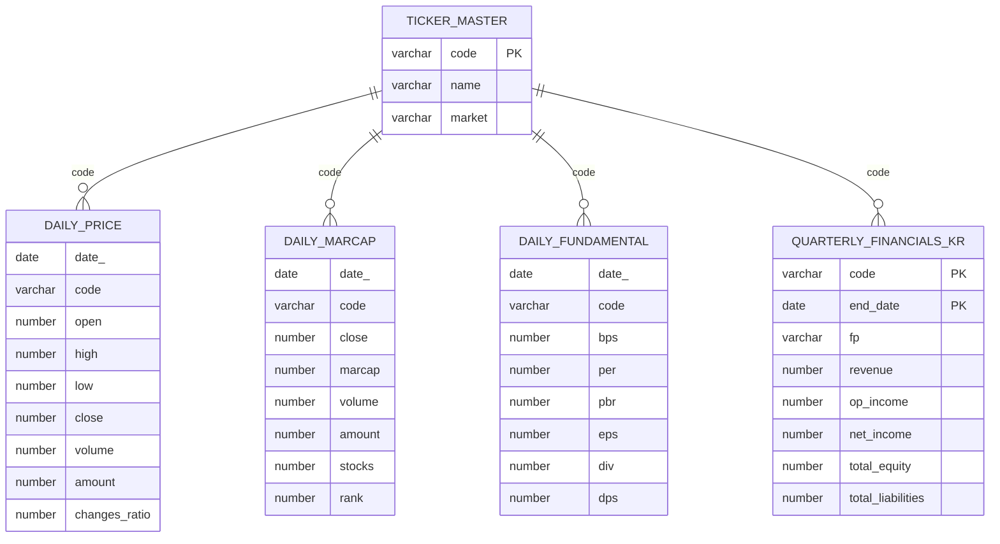
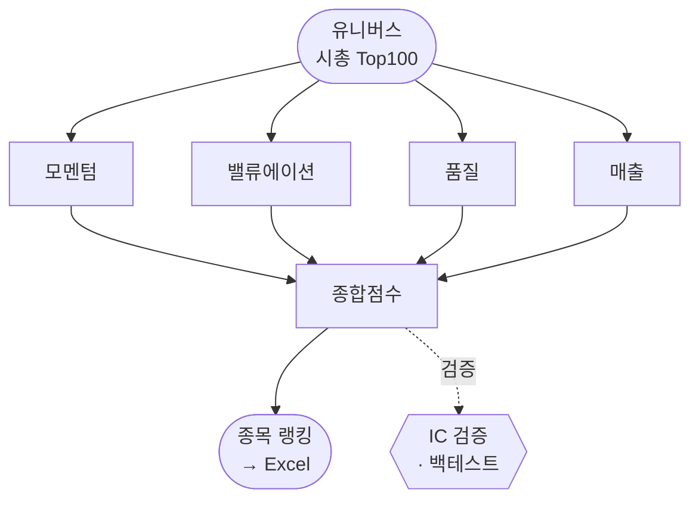

# Stock Screener — 미국·국내 주식 팩터 분석 시스템

미국·국내 주식 시장의 시세·재무 데이터를 직접 수집(ETL)해 자체 DB(Tibero)에 적재하고, SQL·Python으로 팩터를 설계해 종목을 스크리닝하는 개인 퀀트 분석 프로젝트입니다. 데이터 수집부터 DB 모델링, 팩터 스코어링, 통계 검증(IC), 백테스트, 주간 자동화까지 **1인으로 기획·개발·운영**하고 있습니다.

> 📝 **개발 과정 전체 기록 (실제 에러·시행착오 포함, Velog 13편):**
> [미국 주식 팩터 분석 시리즈 — 목차](https://velog.io/@dmlwls40166878/미국-주식-팩터-분석-0-시리즈-목차-읽는-법)

---

## 목차

1. [전체 아키텍처](#1-전체-아키텍처)
2. [ETL 파이프라인](#2-etl-파이프라인)
3. [DB 테이블 구조 (ERD)](#3-db-테이블-구조-erd)
4. [팩터 스코어링 & 검증 흐름](#4-팩터-스코어링--검증-흐름)
5. [파일 구성](#5-파일-구성)
6. [이 프로젝트에서 실제로 배운 것들](#6-이-프로젝트에서-실제로-배운-것들)
7. [실행 방법](#7-실행-방법)
8. [투자 철학](#8-투자-철학)

---

## 1. 전체 아키텍처

외부 데이터 소스에서 수집한 데이터를 Tibero DB에 적재하고, 팩터 스코어링을 거쳐 Excel 리포트로 내보냅니다. 무거운 수집·분석은 항상 켜져 있는 리눅스 서버가 crontab으로 독립 수행하고, 로컬 PC는 결과 파일만 받아옵니다.



---

## 2. ETL 파이프라인

수집(Extract) → 적재(Load)를 시장별·데이터 종류별로 나눠서 수행합니다. 매주 실행 시 이미 적재된 날짜는 자동 스킵(증분 적재)하고, 외부 소스 수집이 실패하면 기존 DB 유니버스로 **폴백**해 파이프라인이 통째로 멈추지 않게 설계했습니다.



**설계 포인트**
- **증분 적재**: `get_loaded_dates()`로 이미 적재된 날짜를 조회해 새 거래일만 수집 → 매주 재실행해도 몇 초.
- **UPSERT**: 분기 재무는 Tibero `MERGE INTO`로 (code, end_date) 기준 있으면 UPDATE, 없으면 INSERT.
- **SEC 태그 함정 처리**: 2018년 회계기준(ASC 606) 변경으로 매출 태그가 갈리는 문제 → 여러 태그를 우선순위로 통합. 단일분기와 누적치(YTD)가 섞여 나오는 문제 → `(end-start)`가 70~100일인 것만 단일분기로 인정.

---

## 3. DB 테이블 구조 (ERD)

시장별로 5개씩, 총 **10개 테이블**입니다. 모든 테이블은 종목코드(`code`)를 공통 키로 `ticker_master`(종목 마스터)와 논리적으로 연결됩니다. (실제 DDL은 대량 적재 속도를 위해 FK 제약 대신 PK/인덱스만 사용 — 아래 관계선은 조인 기준을 나타냅니다.)

### 미국 (US)



### 국내 (KR)



**테이블 역할 요약**

| 테이블 | 역할 | 핵심 컬럼 |
|---|---|---|
| `ticker_master(_us)` | 종목 마스터 (코드↔종목명↔섹터) | code(PK), name, sector, market |
| `daily_price(_us)` | 일별 시세(OHLCV) + 거래대금 | date_, code, close, amount |
| `daily_marcap(_us)` | 일별 시가총액 + **그날의 시총 순위** | date_, code, marcap, rank |
| `daily_fundamental(_us)` | 펀더멘털 **현재값 스냅샷** (과거 히스토리 없음) | per, pbr, roe, debt_to_equity … |
| `quarterly_financials_us/kr` | **분기별 재무 히스토리** (point-in-time 검증의 핵심) | code+end_date(PK), revenue, op_income |

> `daily_fundamental`(yfinance 오늘값 스냅샷)과 `quarterly_financials`(SEC/DART 분기 히스토리)를 **분리**한 게 핵심 설계입니다. IC 검증·백테스트처럼 "그 시점에 알 수 있었던 값"이 필요한 작업엔 반드시 후자를 씁니다. 안 그러면 미래 데이터를 과거에 쓰는 look-ahead bias에 빠집니다.

---

## 4. 팩터 스코어링 & 검증 흐름

시총 Top100 종목에 팩터 **4종**을 계산해 하나의 종합점수로 합치고, 그 점수 순으로 종목을 줄 세웁니다. 점수가 실제로 맞는지는 IC 검증·백테스트로 따로 확인합니다.



### 각 팩터 설명

| 팩터 그룹 | 무엇을 보나 | 세부 지표 |
|---|---|---|
| **모멘텀** | 주가·거래가 얼마나 빠르고 꾸준히 커지는가 | 시총·거래대금의 성장률 / 가속도 / 일관성 |
| **밸류에이션** | 지금 얼마나 비싸게 사는가 | PER · PBR · PEG |
| **품질** | 회사가 실제로 돈을 잘 버는가 | ROE · 영업이익률 · 부채비율 |
| **매출** | 매출이 꾸준히·빠르게 늘고 있는가 | 매출 YoY 일관성 / 가속도 / 성장률 (SEC·DART) |

### 계산 과정

1. **유니버스 선정** — `daily_marcap`에서 시총 상위 100종목을 고릅니다.
2. **순위 정규화** — 각 팩터를 값의 크기가 아니라 **순위(0~1)** 로 바꿉니다. (이상치 하나가 점수를 독식하는 min-max의 문제를 피하려고)
3. **게이트 필터** — 값이 확실히 나쁜 종목만 후보에서 뺍니다(ROE < 0, 부채비율 D/E > 500). 값이 없으면 통과시킵니다.
4. **종합점수** — `Σ(정규화값 × 가중치) × 100`. 가중치는 감이 아니라 **IC 검증 결과**를 근거로 배분합니다.
5. **랭킹 → Excel** — 종합점수 순으로 정렬해 리포트를 만듭니다.

### 최근 분기에 더 무게를 줍니다 (기간 가중치)

모멘텀 팩터(시총·거래대금 성장률)는 최근 4년치(16분기) 분기별 성장률(QoQ%)의 **가중 평균**입니다. 이때 오래된 분기와 최근 분기를 똑같이 취급하지 않고, **최근 분기일수록 가중치를 높게** 줍니다. 3년 전에 반짝했던 것보다 지금 잘하고 있는 게 더 중요하다고 봤기 때문입니다.

```
분기 가중치 = 1.00 + (분기 인덱스 × 0.05)
성장률 점수 = Σ(분기 QoQ% × 가중치) ÷ Σ(가중치)
```

가장 오래된 분기(인덱스 0)는 **1.00배**, 가장 최근 분기(인덱스 15)는 **1.75배**로 선형 증가합니다.

| 시점 | 분기 인덱스 | 가중치 |
|---|---|---|
| 4년 전 (가장 오래됨) | 0 | ×1.00 |
| 3년 전 | 4 | ×1.20 |
| 2년 전 | 8 | ×1.40 |
| 1년 전 | 12 | ×1.60 |
| 최근 분기 (가장 최신) | 15 | ×1.75 |

여기에 더해 **가속도**(최근 4분기 평균 QoQ − 전체 평균 QoQ)를 따로 계산해서, 성장 속도가 최근 들어 빨라지는지(양수) 느려지는지(음수)도 봅니다. 즉 "얼마나 컸나(성장률)" 뿐 아니라 "요즘 더 빨라지고 있나(가속도)"까지 함께 보는 구조입니다.

> ⚠️ 헷갈리기 쉬운 두 가지 가중치를 구분하면 —
> - **기간 가중치** (여기): 팩터 *하나*를 계산할 때, 최근 분기에 더 무게를 주는 것.
> - **종합 가중치** (위 4번): 팩터 *4종을 서로 합칠 때* 쓰는 비중으로, IC 검증 결과를 근거로 배분한 것.

> **핵심 원칙**
> - 모든 계산은 **point-in-time** — 그 시점에 실제로 알 수 있었던 데이터만 씁니다 (SEC 매출은 공시 지연 90일 반영).
> - 팩터는 "그럴듯한 것"이 아니라 **"IC로 검증된 것"만** 가중치를 줍니다 — 유의성 없는 팩터는 점수에서 빼거나 게이트로 강등합니다.

---

## 5. 파일 구성

| 파일 | 역할 |
|---|---|
| `create_tables_us.py` / `create_tables_kr.py` | DB 스키마(DDL) 생성 |
| `run_etl.py` | 가격·시가총액 ETL (pykrx / yfinance, 증분·폴백) |
| `etl_quarterly_sec.py` | SEC EDGAR 분기 매출 수집 (미국) |
| `etl_quarterly_dart.py` | DART OpenAPI 분기 재무 수집 (국내) |
| `etl_fundamental_us.py` | PER/PBR/ROE 등 펀더멘털 스냅샷 수집 |
| `factor_analysis.py` | 팩터 정규화·가중합·게이트 → Excel 리포트 |
| `ic_test.py` | 팩터별 IC(예측력) 통계 검증 |
| `backtest.py` | point-in-time 백테스트 (look-ahead bias 검증 포함) |
| `db_backup.py` / `db_restore.py` | 전 테이블 CSV 스냅샷 백업·복구 |
| `weekly_cron.sh` | 주간 자동화 (ETL → 스크리닝 순차 실행) |
| `screen_*.py`, `*_viz.py`, `sector_dashboard.py` | 구형 스크리닝/시각화 스크립트 (초기 버전, 계속 사용) |

---

## 6. 이 프로젝트에서 실제로 배운 것들

- **min-max 정규화의 함정**: 이상치 하나가 0~1 스케일을 독식해 다른 팩터가 종합점수에 반영 안 되던 문제 → **순위(퍼센타일) 정규화**로 해결 (PBR 440배짜리 이상치 하나가 나머지 종목을 전부 뭉개고 있었음).
- **look-ahead bias**: 현재 시총 Top100을 고정 유니버스로 과거를 보면 수익률이 실제보다 부풀려짐 (CAGR 31.7% → point-in-time 16.5%, 약 2배 차이) → **시점별 유니버스 재구성**으로 해결.
- **"에러 없이 끝났다" ≠ "데이터가 최신화됐다"**: 외부 데이터 소스(위키피디아) 구조 변경으로 ETL 일부가 조용히 실패해도 전체 파이프라인은 "정상 종료"를 찍는 경우를 겪음 → 실패 시 자동 폴백 + `SELECT MAX(date_)`로 실제 최신성 직접 검증하는 습관.
- **통계적으로 유의한 팩터는 생각보다 드물다**: 검증 가능한 10개 팩터를 33분기 IC로 전수검증했더니 `|t|>2`를 넘는 게 하나도 없었음 → "그럴듯한 지표"와 "실제로 작동하는 지표"는 다르다는 걸 숫자로 확인.

> 각 항목의 상세 과정은 위 Velog 시리즈에 코드·에러 메시지·시행착오까지 전부 기록돼 있습니다.

### 특히 읽어볼 만한 글

프로젝트를 하면서 가장 크게 헤맸고, 그래서 가장 많이 배운 글들입니다.

- **[#7 — 돈 내기 싫어서 SEC 공시 사이트를 직접 파봤습니다 (그리고 함정에 두 번 빠졌습니다)](https://velog.io/@dmlwls40166878/미국-주식-팩터-분석-3-SEC-EDGAR로-무료-분기-재무-히스토리-구축하기)** — 유료 API 대신 SEC EDGAR를 직접 파싱하며 회계기준 태그 변경·누적치 혼재 함정을 잡은 이야기.
- **[#9 — 제가 만든 팩터, 백테스트 돌려보니 수익률이 반토막났습니다](https://velog.io/@dmlwls40166878/미국-주식-팩터-분석-9-백테스팅-팩터가-진짜-돈이-됐는지-검증하기)** — look-ahead bias로 CAGR이 31.7%까지 부풀려졌다가 16.5%로 내려앉은 과정.
- **[#10 — 제 팩터 점수, 알고 보니 이상치 하나가 다 해먹고 있었습니다](https://velog.io/@dmlwls40166878/미국-주식-팩터-분석-10-팩터가-진짜-의미-있나-진단과-계산-개선)** — min-max 정규화의 함정과 순위 정규화로의 전환.
- **[#11 — 제가 쓰던 팩터 10개를 3년치 데이터로 검증했더니, 유의미한 건 하나도 없었습니다](https://velog.io/@dmlwls40166878/미국-주식-팩터-분석-11-어떤-팩터가-진짜-예측력이-있나-IC-전수검증과-가중치-재설계)** — IC 전수검증으로 "그럴듯한 지표"의 실체를 마주한 글. **(시리즈의 하이라이트)**
- **[#12 — "정상 종료"의 함정, 조용히 죽어있던 ETL 두 건](https://velog.io/@dmlwls40166878/미국-주식-팩터-분석-12-정상-종료의-함정-조용히-죽어있던-ETL-두-건)** — 에러 없이 끝나는데 데이터는 몇 주째 멈춰 있던 무증상 실패 이야기.

---

## 7. 실행 방법

```bash
# 0) 환경변수 (코드에는 비밀값 없음 — 실행 환경에서 주입)
export TIBERO_USER=... TIBERO_PASS=...
export DART_API_KEY=...          # 국내 분기재무
export KRX_ID=... KRX_PW=...     # 국내 펀더멘털

# 1) 테이블 생성 (최초 1회)
python3 create_tables_us.py
python3 create_tables_kr.py

# 2) ETL (증분 적재)
python3 run_etl.py --us          # 미국 시세·시총
python3 etl_quarterly_sec.py     # 미국 분기 매출
python3 etl_fundamental_us.py    # 미국 펀더멘털 스냅샷
python3 run_etl.py --kr          # 국내

# 3) 팩터 스코어링 → Excel 리포트
python3 factor_analysis.py            # 미국
python3 factor_analysis.py --kr       # 국내
python3 factor_analysis.py --refresh  # ETL 최신화 후 스크리닝까지 한 번에

# 4) 검증
python3 backtest.py              # point-in-time 백테스트
python3 ic_test.py               # 팩터 IC 전수검증
```

**실행 환경**: Python 3.11, Tibero 7 (JayDeBeApi / JDBC), `requirements.txt` 참고.

---

## 8. 투자 철학

이 프로젝트를 만들며 데이터로 직접 확인한 것들이, 그대로 저의 투자 원칙이 됐습니다.

1. **검증한 것만 믿는다.** "그럴듯해 보이는 지표"와 "실제로 작동하는 지표"는 다릅니다. IC 검증을 통과하지 못한 팩터는 아무리 말이 되어 보여도 점수에 넣지 않습니다.
2. **높은 점수 ≠ 안전.** 이 모델은 *지금 가장 강한 종목*을 골라줄 뿐, *언제 꺾일지*는 모릅니다. 점수가 높다고 안심하지 않습니다.
3. **분산하고, 작게 베팅한다.** 한 종목·한 시점에 몰아넣지 않고, 리밸런싱으로 천천히 따라갑니다.
4. **최근을 더 믿되, 과거를 버리지 않는다.** 최근 분기에 가중치를 더 주지만(위 [기간 가중치](#4-팩터-스코어링--검증-흐름)), 한두 분기 반짝을 꾸준함으로 착각하지 않습니다.
5. **겸손하게.** 33분기를 검증해도 통계적으로 유의한 팩터는 거의 없었습니다. 내 모델이 시장 앞에서 틀릴 수 있다는 걸 항상 전제로 둡니다.

> 요약하면 — **데이터로 확인하고, 검증된 만큼만 베팅하고, 틀릴 수 있다는 걸 잊지 않는 것.** 이 원칙 자체가 위 IC 검증·백테스트·정규화 개선 과정에서 나왔습니다.
